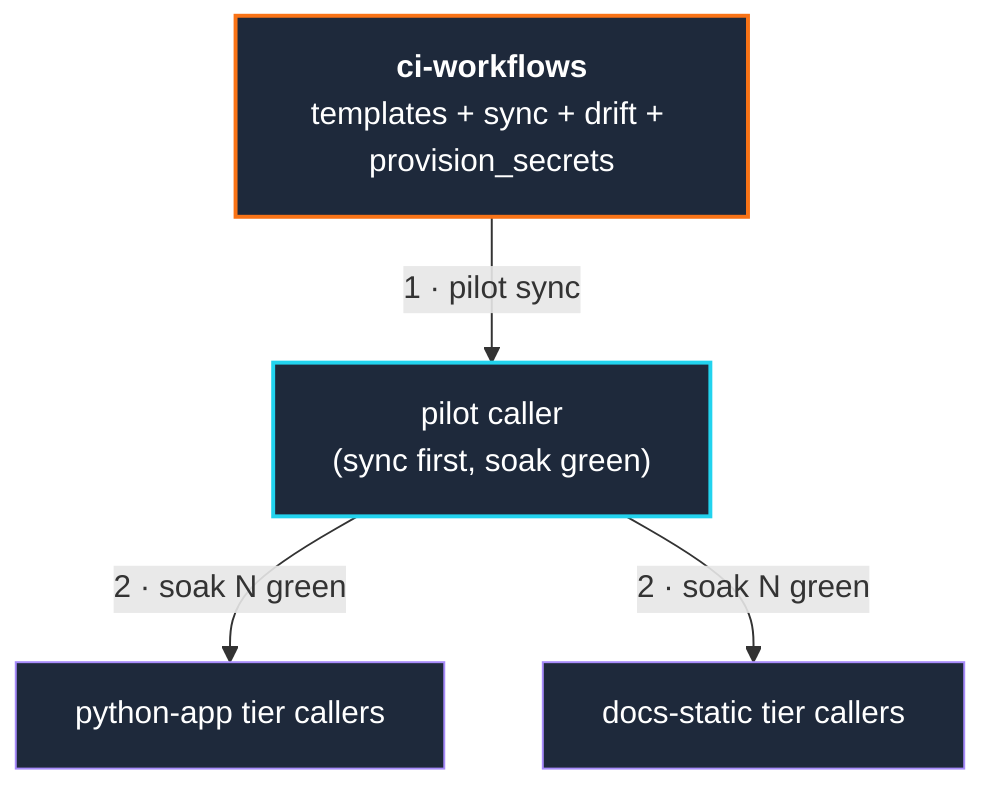

# ci-workflows

[](https://github.com/effecet/ci-workflows/actions/workflows/ci.yml)
[](https://www.python.org/)
[](https://docs.astral.sh/ruff/)
[](https://docs.pytest.org/)
[](https://github.com/rhysd/actionlint)
[](https://github.com/gitleaks/gitleaks)
[](./LICENSE)

A **CI template-generation system** for a fleet of repositories. Instead of
relying on reusable workflows, it renders parametrized workflow templates into
each repo's `.github/workflows/` and fans the changes out via pull requests:

- `render` — render a tier's templates for a caller repo
- `sync.py` — open/update sync PRs across all registered callers
- `drift.py` — detect when a caller's committed workflows diverge from the template
- `provision_secrets.py` — fan out CI secrets via the Forgejo/Gitea API

It targets **Forgejo / Gitea** (e.g. Codeberg) but the rendered workflows are
standard GitHub Actions YAML and run on GitHub Actions too.

> This is a template/reference implementation. Replace `callers.yml` with your
> own repositories and adapt the templates to your stack.

## Why template-generation, not `workflow_call`

`workflow_call` (GitHub's reusable-workflow mechanism) is **broken on Forgejo**
as of this writing: called workflows enqueue but never dispatch. So "shared CI
behavior" can't live in one callable workflow — instead it lives in these
templates, and a `sync.py` fanout commits the rendered result into each caller.
On a platform where `workflow_call` works, you may not need the fanout at all;
the templates are still useful as a starting point.

## Topology



## Layout

| Path | Purpose |
|---|---|
| `templates/python-app/` | python tier — ruff + pytest + gitleaks on push/PR; weekly full-history sweep |
| `templates/docs-static/` | docs tier — markdownlint + lychee + gitleaks on push/PR; weekly sweep |
| `templates/_snippets/` | shared includes (uv setup, dep install, failure notifier) |
| `callers.yml` | registry of caller repos with tier + per-job runner overrides |
| `src/ci_workflows/` | Python package: `registry`, `render`, `forgejo`, `sync`, `drift`, `provision_secrets` |
| `tests/` | pytest suite (golden-file fixtures for templates + mocked Forgejo responses) |
| `bot/` | optional self-hosted-runner Telegram notifier (script + systemd unit) |

## Quick start

```bash
git clone https://github.com/effecet/ci-workflows.git
cd ci-workflows
python3 -m venv .venv && source .venv/bin/activate
pip install -e '.[dev]'

# 1. Edit callers.yml — list YOUR repos and their tiers (see the file's comments).
# 2. Dry-run (renders to memory, no network):
make dry-run VERSION=v1.0.0
# 3. Sync the pilot caller, then fan out once it's green:
make pilot  VERSION=v1.0.0
make soak
make fanout VERSION=v1.0.0
# 4. Check for drift any time:
make drift  VERSION=v1.0.0
```

For commands that hit the Forgejo/Gitea API (`sync`, `drift`, `provision-secrets`),
set a token in the environment first (e.g. `CODEBERG_TOKEN=...`, or a file passed
to `provision_secrets.py --env`).

## Tier tools

| Tier | On push/PR | Weekly sweep |
|---|---|---|
| `python-app` | `ruff format --check`, `ruff check`, `pytest -q`, `gitleaks --no-git` | `gitleaks` full-history |
| `docs-static` | `markdownlint-cli2`, `lychee` (advisory), `gitleaks --no-git` | same |

Each caller's weekly sweep cron minute is `sha256(repo_short_name)[0] % 60`, which
smears callers across an hour so a shared runner pool isn't hit all at once.

### Per-caller `runs_on` override

Default runner per job comes from the tier. Override per-job in `callers.yml`:

```yaml
- repo: example-org/example-python-app
  tier: python-app
  runs_on:
    lint-test: ubuntu-latest      # or your self-hosted label
    gitleaks-fast: ubuntu-latest
    sweep: ubuntu-latest
```

Schema validation rejects unknown job keys at `sync.py` load time.

### Preserving non-templated workflows

By default `sync.py` sweeps every non-templated `*.yml` under a caller's
`.github/workflows/`. Opt a workflow out with `preserve:` (exact filenames,
`.yml`/`.yaml` only):

```yaml
- repo: example-org/example-python-app
  tier: python-app
  preserve:
    - custom-smoke.yml
```

### Install backend — lessons learned

The `python-app` tier installs dependencies via [`uv`](https://github.com/astral-sh/uv):
a shell install of `uv`, then `uv python install 3.12`, then a per-job venv. The
editable install (`uv pip install -e .`) is **guarded** — it only runs if the repo
is actually a package (a `[project]`/`[build-system]` table in `pyproject.toml`, or
a `setup.py`/`setup.cfg`); a config-only `pyproject.toml` falls back to
`requirements*.txt`. No `|| true` masking — a real package with a broken build
still fails loudly.

A few hard-won notes from running this in production:

- Pinning a third-party action by a tag your Forgejo action mirror doesn't carry
  will fail — prefer a shell install over `uses:` when the mirror is incomplete.
- `uv pip install --system` needs a pre-existing system Python at the requested
  version; a per-job `uv venv` is more portable across runner images.
- Don't run an unconditional `uv pip install -e .` — a config-only `pyproject.toml`
  (e.g. just `[tool.pytest.ini_options]`) is not a package and will fail
  setuptools auto-discovery. Guard on package-ness.

### Fanout pacing

Some hosts silently throttle burst PR creation. For large fanouts, pass
`--rate-limit-cooldown=<seconds>` to sleep between callers, and include the caller
name in each PR title to avoid "similar title" anti-spam. `make fanout` sets a
conservative default — override with `make fanout RATE_LIMIT_COOLDOWN=0`.

## Self-hosted runner (optional)

The rendered jobs run on whatever runner label you set (`ubuntu-latest` by
default on GitHub). If you add a self-hosted runner (e.g. an ARM64 box), give it
a label and target it per-job via `runs_on:`. A practical strategy: keep the
single source of truth for green-on-PR on a hosted runner, and use a self-hosted
runner as a **parallel** secondary signal (architecture coverage, no shared-pool
contention) rather than a replacement. The optional [`bot/`](./bot/README.md)
notifier posts a Telegram message on job pickup for a self-hosted runner — set
`TELEGRAM_CI_TOKEN` and `TELEGRAM_CHAT_ID` as secrets to use it (it's a no-op if
the token is unset).

## Contributing

**Never** hand-edit a caller's `.github/workflows/ci.yml` or `gitleaks-sweep.yml`
— they carry an `AUTO-GENERATED — DO NOT EDIT` banner and are overwritten on every
sync. Edit the tier template here, cut a new tag, and run `sync.py`.

Per-caller customization happens through conventional files the templates fall
back to when present:

| File | Used by | Tier |
|---|---|---|
| `.ruff.toml` / `[tool.ruff]` in `pyproject.toml` | ruff | python-app |
| `.gitleaks.toml` | gitleaks | all |
| `.markdownlint.json` | markdownlint-cli2 | docs-static |

## License

MIT — see [`LICENSE`](./LICENSE).
